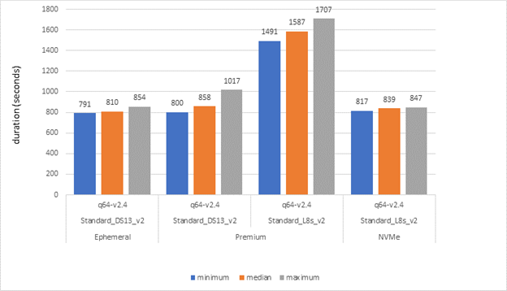
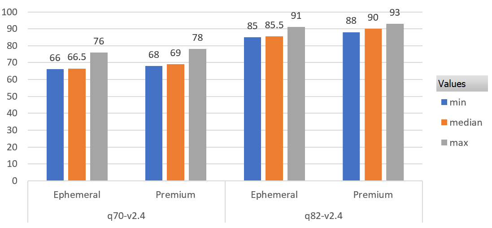

# Spark on Azure Kubernetes Service

<!--
Guidelines on README format: https://review.docs.microsoft.com/help/onboard/admin/samples/concepts/readme-template?branch=master

Guidance on onboarding samples to docs.microsoft.com/samples: https://review.docs.microsoft.com/help/onboard/admin/samples/process/onboarding?branch=master

Taxonomies for products and languages: https://review.docs.microsoft.com/new-hope/information-architecture/metadata/taxonomies?branch=master
-->

## Build Status

| Status                                                                            |
| --------------------------------------------------------------------------------- |
|  |

## Contents

| File/folder       | Description                                |
| ----------------- | ------------------------------------------ |
| `.github`         | Github specific configuration              |
| `.gitignore`      | Define what to ignore at commit time.      |
| `aks-spark-chart` | Helm Charts                                |
| `benchmark`       | Benchmark test code                        |
| `docs`            | Project documentation                      |
| `env`             | Terraform to build environment             |
| `results`         | Benchmark results images                   |
| `spark`           | Spark Docker containers and config         |
| `CODE_OF_CONDUCT.md` | Code of Conduct for this project        |
| `CONTRIBUTING.md` | Guidelines for contributing to the sample. |
| `CHANGELOG.md`    | List of changes to the sample.             |
| `LICENSE`         | The license for the sample.                |
| `README.md`       | This README file.                          |
| `SECURITY.md`     | This SECURITY file.                        |
| `SUPPORT.md`      | The SUPPORT policy for this project file.                         |
## Prerequisites

This project requires the user to have access to the following:

- An Azure AAD Tenant and the ability to create AAD Applications
- An Azure Subscription

This project also requires a development environment with the following tools installed

- [Terraform](https://learn.hashicorp.com/terraform/getting-started/install)
- [kubectl](https://kubernetes.io/docs/tasks/tools/install-kubectl/)

## Setup

- [Deploy the Environment](env/Readme.md)
- [Build and Deploy Dockerfiles](spark/Readme.md)
- [Apply Kubernetes configuration](kubernetes/Readme.md)
- [Run benchmark](benchmark/README.md)

## About TPC-DS Benchmark

TPC-DS, a third-party committee that provides industry standard benchmark tools for measuring performance of decision support solutions. You can access the various tools on their [website](http://www.tpc.org/tpcds/default5.asp).

This project implements a derivative of TPC-DS benchmark wrapped within [Databricks](https://github.com/npoggi/spark-sql-perf/tree/spark-3_update) sql perf libraries. In this derivative benchmark, we evaluated and measured the performance of Spark SQL on Azure Kubernetes (AKS). Our tests was limited to q64-v2.4, q70-v2.4, q82-v2.4 queries.
## Running the sample

The required steps to run the performance benchmark is documented [here](./benchmark/README.md#run-benchmark)

### Kubernetes Node pools

Benchmark test was executed on 2 different types of Node sizes.

| Node size        | Node count | OS disk size | OS disk type |
|------------------|------------|--------------|--------------|
| [Standard_DS13_v2](https://docs.microsoft.com/en-us/azure/virtual-machines/dv2-dsv2-series-memory) | 5          | 256          | [Ephemeral](https://docs.microsoft.com/en-us/azure/virtual-machines/ephemeral-os-disks)    |
| [Standard_DS13_v2](https://docs.microsoft.com/en-us/azure/virtual-machines/dv2-dsv2-series-memory) | 5          | 256          | [Premium](https://docs.microsoft.com/en-us/azure/virtual-machines/disks-types#:~:text=Azure%20premium%20SSDs%20deliver%20high-performance%20and%20low-latency%20disk,Premium%20SSDs%20are%20suitable%20for%20mission-critical%20production%20applications.)      |
| [Standard_L8s_v2](https://docs.microsoft.com/en-us/azure/virtual-machines/lsv2-series?toc=/azure/virtual-machines/linux/toc.json&bc=/azure/virtual-machines/linux/breadcrumb/toc.json) | 5          | 256   | [NVMe](https://docs.microsoft.com/en-us/azure/virtual-machines/lsv2-series?toc=/azure/virtual-machines/linux/toc.json&bc=/azure/virtual-machines/linux/breadcrumb/toc.json) |        

### Spark parameters

The following sparkConfig was used for this benchmark.

| sparkConfig        | Value |
|--------------------|-------|
| spark.driver.cores | 4     |
| spark.driver.memory | 16000m |
| spark.driver.memoryOverhead | 2000m |
| spark.executor.cores | 4     |
| spark.executor.memory | 16000m |
| spark.executor.memoryOverhead | 2000m |

| Serializer       |  Value                                     | Default |
|------------------|--------------------------------------------|---------|
| [spark.serializer](https://spark.apache.org/docs/latest/tuning.html) | org.apache.spark.serializer.KryoSerializer | Java serialization |

Additional parameters are documented in [this](benchmark/spark-benchmark-test.yaml) SparkApplication yaml.

## Results

In total, 10 iterations of the query have been executed and median execution time was recorded.

- Execution time (in seconds) of q64 with Ephemeral, Premium and NVMe disk on D and L series VMs

- Execution time(in seconds) of q82, q70 with Ephemeral vs Premium OS disk

## Contributing

This project welcomes contributions and suggestions. Most contributions require you to agree to a
Contributor License Agreement (CLA) declaring that you have the right to, and actually do, grant us
the rights to use your contribution. For details, visit https://cla.opensource.microsoft.com.

When you submit a pull request, a CLA bot will automatically determine whether you need to provide
a CLA and decorate the PR appropriately (e.g., status check, comment). Simply follow the instructions
provided by the bot. You will only need to do this once across all repos using our CLA.

This project has adopted the [Microsoft Open Source Code of Conduct](https://opensource.microsoft.com/codeofconduct/).
For more information see the [Code of Conduct FAQ](https://opensource.microsoft.com/codeofconduct/faq/) or
contact [opencode@microsoft.com](mailto:opencode@microsoft.com) with any additional questions or comments.

## Credits

- Many thanks to [@juan-lee](https://github.com/juan-lee) and [@alexeldeib](https://github.com/alexeldeib) for reviewing the AKS and NVMe setup.

- Thanks to [@alokjain-01](https://github.com/alokjain-01) for helping with Spark parameters

  